### 24 ноября 
### Тема: Базовая геометрия


##### Темы к коллоквиуму:
* ToDo (@Aphanasiy)


## Конспект:

Слайды: [[Алгоритмы] Вычислительная геометрия.pdf]([Алгоритмы]\ Вычислительная\ геометрия.pdf)

### Множители и делители
Импортируем модуль math – один из наиважнейших в Python. Этот модуль предоставляет обширный функционал для работы с числами.
```
import math 
```
#### Задача 1: Поиск наибольшего общего делителя
*НОД*, или наибольший общий делитель двух целых чисел — наибольшее число, на которое эти два числа делятся. Например, для 91 и 28 НОД равен 7, а для 36 и 47 НОД равен 1.

Напишем рекурсивную функцию для поиска НОД двух чисел, a и b. Будем по умолчанию считать, что a > b. В каждой итерации мы находим остаток от деления a % b и запускаем эту же функцию для b и получившегося остатка. Если b достигло 0, значит, рекурсия достигла конца, и мы возвращаем a. Выведем переменные каждой итерации, чтобы посмотреть, как это работает.

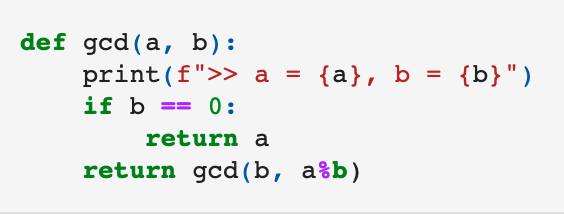

Функция map позволяет присвоить набору переменных значения из списка. Так можно с помощью input вводить значения через пробел, потом делить их по пробелам функцией split, а затем быстро присваивать значения из полученного списка переменым a и b.

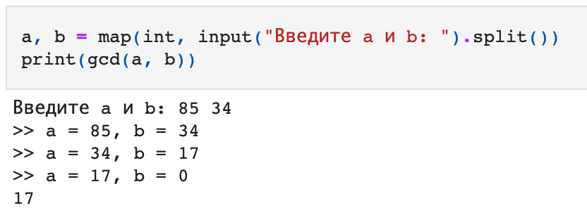

(Это очень удобно, но дальше в конспекте я буду писать конкретные значения, чтобы его было легче читать без запуска тетрадки.)

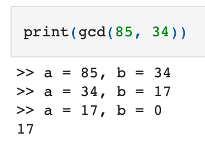

Что будет, если a < b? В таком случае на первой итерации a % b будет равняться a. Например, 21 % 87 = 21. А мы подаём в следующую итерацию b и a%b, то есть b и a. Фактически, за счёт этой дополнительной итерации a и b просто поменяются местами.

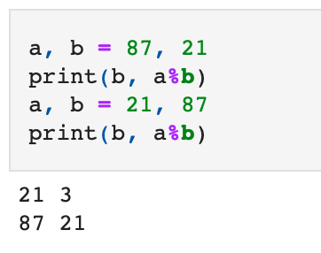

Убедимся, что это так. Сравните вывод с a=34, b=85 и вывод с a=85, b=34, который был выше. Всё то же самое, только в начале появилась дополнительная итерация, которая меняет a и b местами. Засчёт этого можно не проверять, что a > b.

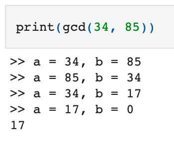

Попробуем реализовать ту же логику не через рекурсию, а через цикл:

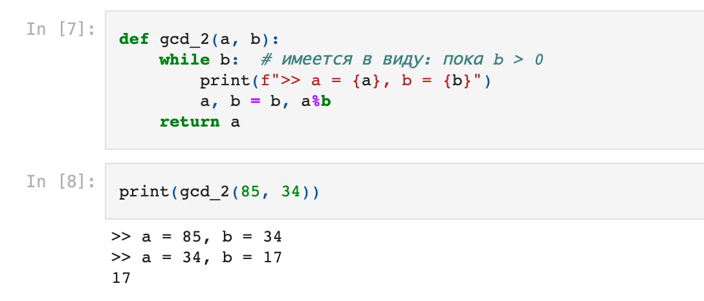

Можно увидеть, что итераций получается меньше.

#### Задача 2: Проверка на «простоту»

Целое число называют *простым*, если оно делится только на 1 и на само себя. Напишем функцию, которая будет определять, является ли число n простым. Для этого нам нужно найти какой-нибудь делитель n в диапазоне (1, n). Если мы такой делитель находим, то число не простое.

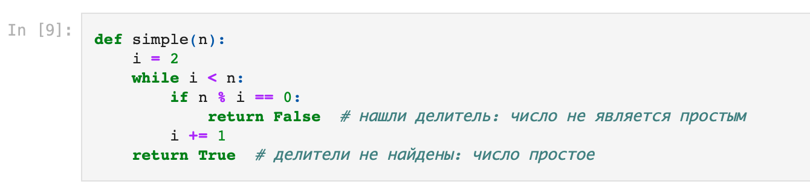

Функция перебирает итератором i числа, начиная с двойки. Нам нужно перебрать все числа от двойки до n и найти среди них делители. Если данное число n делится на i без остатка, то оно не простое, мы прерываем цикл и выдаём False. Если ни в одной итерации такого не произошло, а i уже достигло n, цикл прекращается (это описано через while). Если функция дошла до этого момента, значит, делителей мы не нашли. Поэтому мы сообщаем пользователю, что число простое, и выдаём True.

Такую функцию можно немного оптимизировать. По большому счёту, мы ищем наименьший делитель n, который больше 1 (вообще мы ищем любой делитель, но числа перебираются от 1 до n, поэтому мы можем найти либо наименьшей делитель, либо не найти никакого). Но наименьший делитель не может быть больше, чем корень из n. Например: наименьший делитель числа 100 не может быть больше 10. Да, есть делители, например, 30, 50 и другие, но все они не простые числа, а значит, не наименьшие делители. То есть если мы достигли корня из n и ничего не нашли, перебор можно заканчивать. Более подробное и понятное доказательство можно почитать [здесь](http://mech.math.msu.su/~shvetz/54/inf/perl-problems/chPrimes_sIdeas.xhtml).

Напишем while таким образом, чтобы i был меньше или равен корню из n. Или, проще, i в квадрате был меньше или равен n.

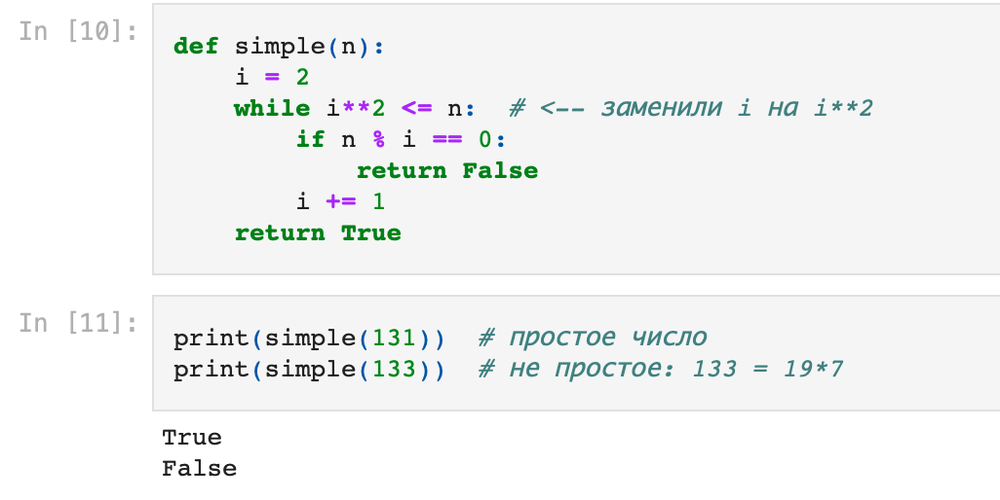

Всё работает правильно.

#### Задача 3: Разложение на множители

Разложение на множители, или факторизация — это попросту поиск всех простых множителей числа. В результате такой операции должен получиться список простых чисел, которые можно перемножить, чтобы получить изначальное число. Например, для числа 38 264 594 простые множители выглядят так: 43 781 23 19 * 2 = 38 264 594.

Функция для поиска множителей будет похожа на функцию проверки на простоту, которую мы уже написали выше. Будем перебирать числа, начиная с двойки и до корня из n (помним об оптимизации). Если мы наткнулись на делитель, делим на него до упора, пока результат остаётся целым. Все найденные простые делители будем складывать в список k.

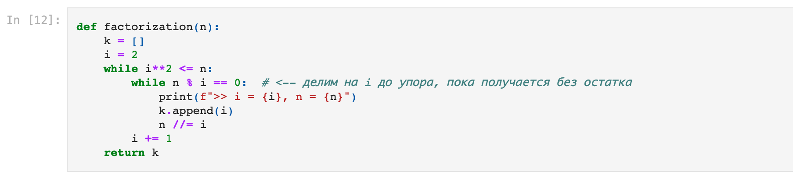

С таким алгоритмом может получиться так, что последний множитель не добавлен в список. Например, попробуем разложить число 20. Делим на двойку до упора: 20 // 2 = 10, 10 // 2 = 5. Теперь n = 5. Мы могли бы продолжить перебор, но мешает условие оптимизации, которое мы сами поставили в while. Следующее число в переборе должно быть 3, но 3 в квадрате больше, чем 5, и перебор не продолжается. Таким образом, число 5 не добавляется в список k.

Эту проблему можно решить по-разному. Простой способ: после окончания цикла добавить в список переменную n, оставшуюся после деления. Поставим условие: n не должно быть равно 1 (1 по понятным причинам не считается релевантным множителем)

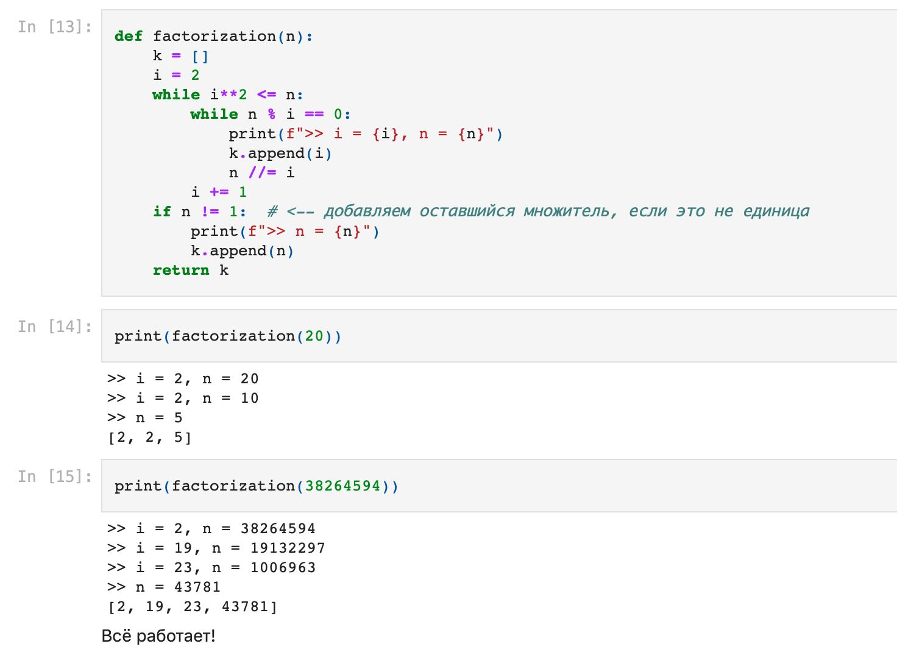

#### Задача 4: Решето Эратосфена

*Решето Эратосфена* — один из известных алгоритмов поиска простых чисел в определённом диапазоне.

На каждой итерации алгоритма мы «отсеиваем» те числа, которые не являются простыми. Будем делать это с помощью списка sieve, в котором элемент с индексом i будет представлять число i. По умолчанию заполним всё решето единицами, а если узнаем, что i не является простым, то заменим единицу на ноль. Тогда по окончанию работы функции у нас останется список-решето, в котором единицы будут указывать, какие числа оказались простыми, то есть непросеенными.

Сама суть алгоритма решета Эратосфена заключается в следующем: мы перебираем числовой ряд и для каждого числа i отсеиваем числа 2i, 3i, 4i, и так далее. Эти числа точно не являются простыми, ведь они делятся на какое-то натуральное число и ещё на i. Само число i может быть простым, поэтому его мы не отсеиваем. Если при переборе мы натыкаемся на уже отсеенное число, его мы не рассматриваем и идём дальше.

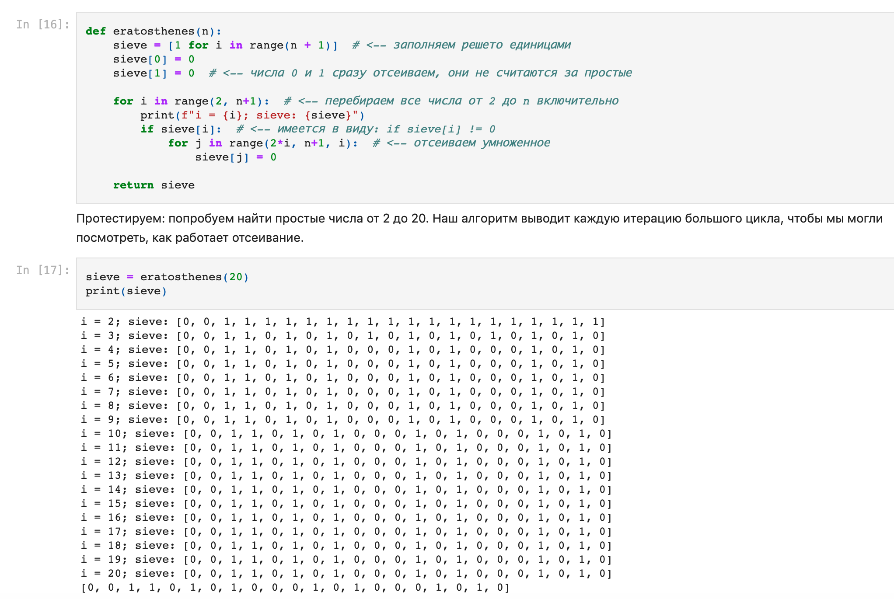

Если внимательно посмотреть, можно увидеть, как на итерации i=3 отсеиваются все чётные числа (кроме двойки), на итерации i=4 отсеиваются числа, кратные 3, и так далее. (Обратите внимание: список начинается с индекса 0.)

«Вынем» все найденные простые числа из получившегося решета:

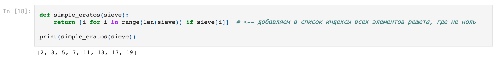

Наш алгоритм решета Эратосфена тоже можно оптимизировать. Во-первых, уже известным нам способом: заканчивать перебор досрочно на корне из n. Во-вторых, когда мы при отсеивании смотрим на числа 2i, 3i, 4i, …, мы совершаем некоторую лишнюю работу. Если во внешнем цикле мы дошли до числа i, значит, числа 2, 3, … i-2, i-1 и их произведения уже были рассмотрены в предыдущих итерациях. Минимальное число, которое ещё не было отсеено — само число i. Поэтому можно начинать внутренний цикл с отсеиванием не с 2i, а с квадрата i.

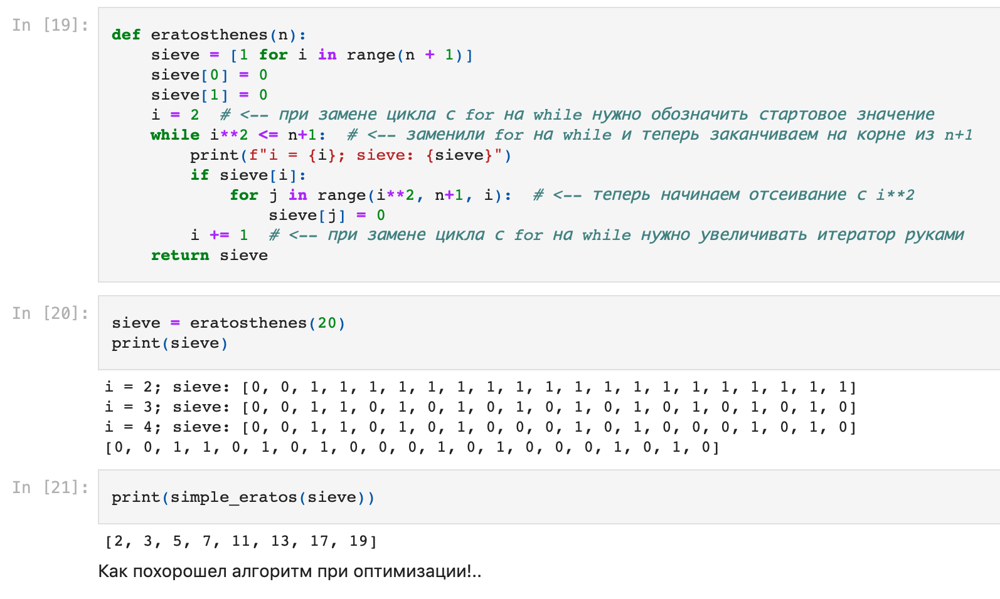

#### Задача 4.1: Решето Эратосфена для разложения на множители

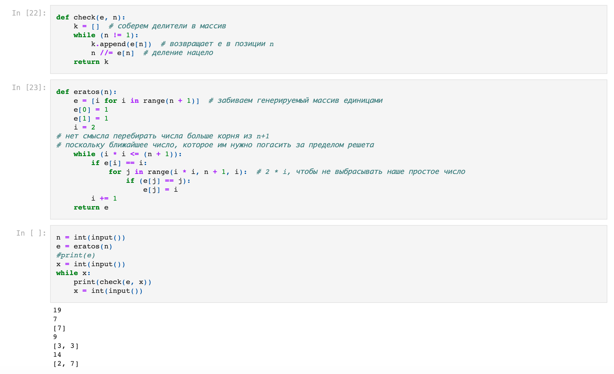

#### Реализация алгоритма решета Эратосфена с хабра

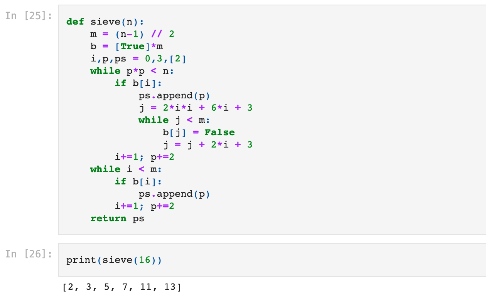

#### Классы для решения задач с точками и векторами

Задача: фрёкен Бок, Малыш и Карлсон находятся в разных точках на координатной плоскости. Фрёкен Бок смотрит на Малыша по прямой. Необходимо определить, в каком ухе жужжит у фрёкен Бок от пропеллера Карлсона, то есть где находится Карлсон относительно её взгляда — слева, справа или ровно по прямой.

Используем для решения этой задачи классы. Напишем класс Point, который будет обозначать точку.

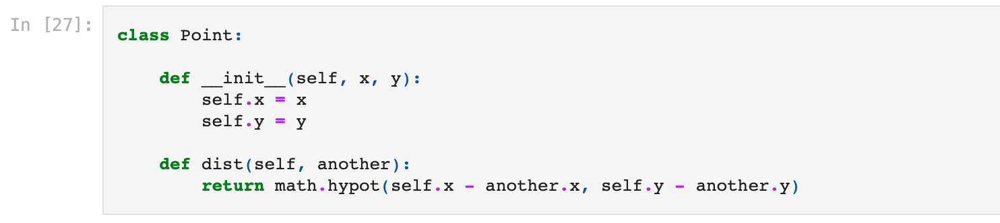

В функции init прописываются базовые свойства объекта класса. Функция dist будет выдавать расстояние между двумя точками.

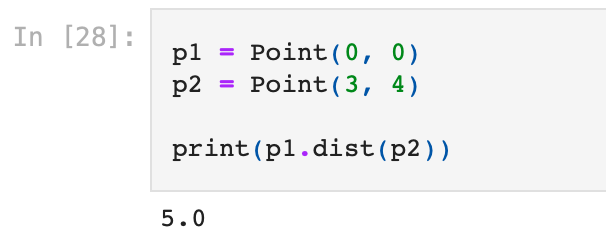

Другой класс сделаем для векторов. Добавим в него так называемые [специальные методы](https://pyneng.readthedocs.io/ru/old_chapter_order/book/26_oop_special_methods/index.html), которые можно установить для любого класса. Их можно вызывать не только по названиям, но и особыми простыми сокращениями. Например, функция mul представляет собой операцию умножения. Прописав этот метод для класса, мы сможем умножать векторы обычным знаком умножения в Python — астериском. Метод repr нужен для строкового отображения объекта класса при вызове функции print. Набор специальных методов, встроенных в Python, ограничен. Все они в коде обрамляются двойным подчёркиванием.

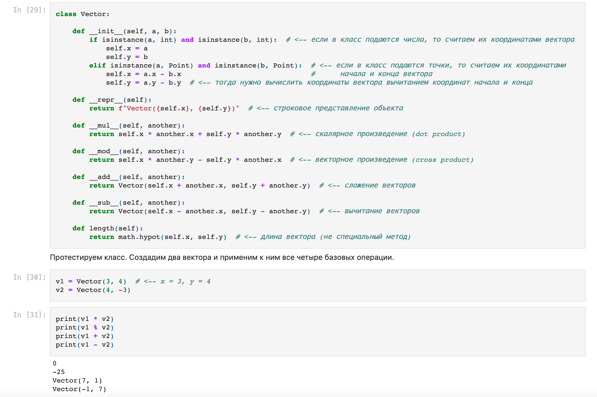

Наши векторы оказались перпендикулярны, поэтому их скалярное произведение равно 0.

Итак, приступим к решению задачи. Вот так, как показано ниже, можно ввести значения векторов через input. С помощью астериска перед list мы превращаем элементы списка в набор переменных, который можно передать классу, и создаём переменные-точки для каждого персонажа.

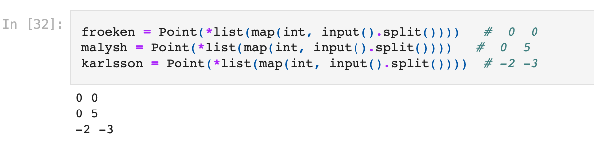

Отдельная функция будет принимать эти точки и решать задачу. Она найдёт векторное произведение двух векторов, прямых линий от фрёкен до Малыша и до Карлсона. По этому векторному произведению будет понятно, с какой стороны находится Карлсон.

(Векторное произведение равно произведению длин векторов на синус угла между ними. Длины всегда положительны, а синус меняет знак в зависимости от того, с какой стороны от вектора a находится b. Так, если синус положительный, то вектор b слева от a, если отрицательный — справа, а если равен нулю — векторы коллинеарны.)

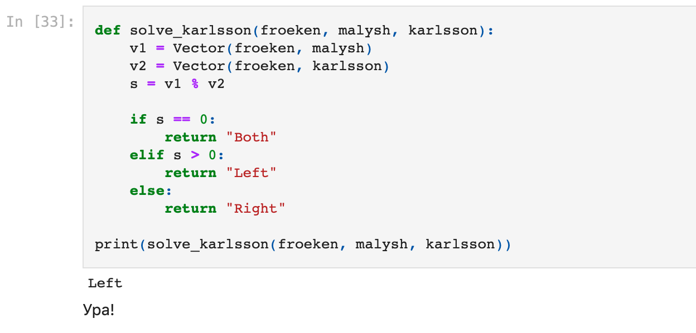
